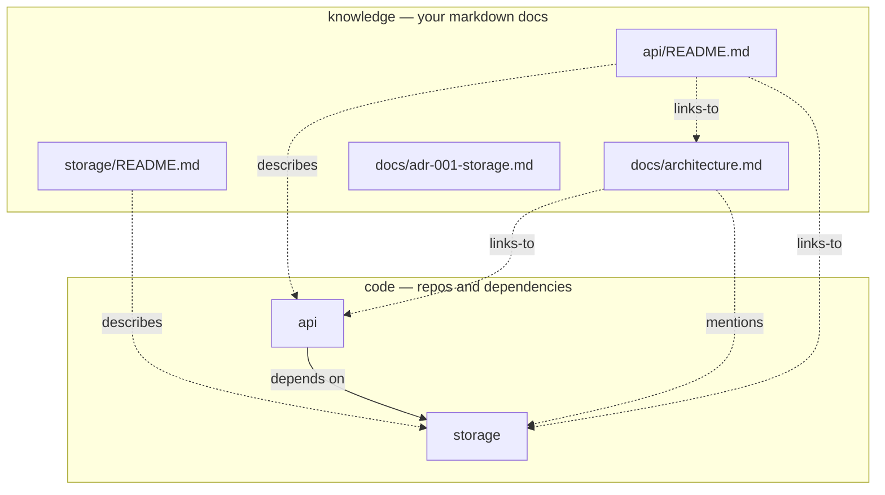
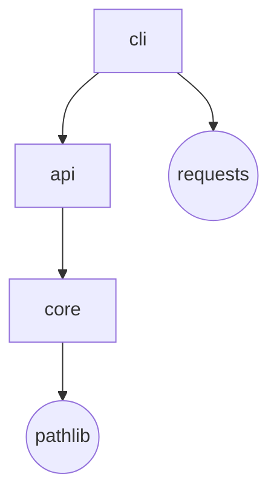

# index

> **See the shape of any codebase** — its repositories, how they depend on each other, *and* the docs that explain them — as one explorable map. Built from real code evidence. Zero dependencies.

[](LICENSE)


[](https://github.com/HarperZ9/index-graph/actions/workflows/ci.yml)


`index` points at a folder full of Git repositories and answers a question that gets harder every time your workspace grows: **how does all of this actually fit together?** It maps repo-to-repo dependencies from real evidence (the import, the manifest line — with the file and line that proves it), and with `index atlas` it pulls your **markdown docs into the same map** as first-class nodes, so the code and the knowledge that explains it sit side by side. The output is one self-contained HTML file — no server, no build step, no account, nothing to install but Python.

---

## Why

Past a handful of repos, the mental model lives in your head and nowhere else. New teammates rebuild it by grepping. The READMEs and ADRs that explain *why* a service exists are scattered across a dozen repos, disconnected from the code. `index` makes that model an artifact: a deterministic map you can open, search, and hand to someone else.

**Who actually reaches for this:**

- **You inherited a workspace you didn't write.** Twenty repos, no diagram, the author left. `index atlas --root . --format html` gives you something to read on day one.
- **You run a monorepo or a multi-repo product.** You want to see the dependency lanes, catch a cycle, and find the doc that describes a service without `cd`-ing through ten folders.
- **You maintain a lot of open source.** Repos plus their READMEs/ADRs as one navigable graph, regenerated deterministically so it never drifts from reality.
- **You're writing onboarding docs.** Drop the self-contained HTML into a wiki or hand it over — it works offline, forever, with no hosting.

---

## 30-second quickstart

```bash
pip install index-graph

# the two-layer code + knowledge map (the headline):
index atlas --root /path/to/your/workspace --format html --out atlas.html
open atlas.html        # macOS/Linux   ·   start atlas.html on Windows

# or just the repo dependency graph:
index viz --root /path/to/your/workspace --format html --out graph.html
```

Each command writes **one HTML file**. Open it in any browser, offline. No assets to host, nothing phones home.

---

## `index atlas` — the two-layer map

Most dependency tools stop at the code. `index atlas` adds the layer that explains it: every markdown file in the workspace becomes a node, linked to the code it documents.



Four edge types, each derived from evidence — never guessed:

| Edge | Means | Derived from |
|------|-------|--------------|
| **depends-on** | repo → repo | a real import + manifest dependency, with the witnessing file:line |
| **describes** | doc → repo | the doc lives inside that repo's tree |
| **links-to** | doc → doc/repo | a `[[wiki-link]]` in the doc body |
| **mentions** | doc → doc/repo | the name appears in prose (weakest; dimmed, toggle in the legend) |

Open the result and you get a real workbench, not a static picture:

```
┌──────────────────────────────────────────────┬───────────────────────┐
│  search repos + docs…   [reset][focus][○ ...] │  Architecture  ·doc   │
│                                                │  links: api, storage  │
│       ┌─────┐         ┌─────────┐              │  linked from: api/RE… │
│       │ api │────────▶│ storage │   ← repos    │  ───────────────────  │
│       └──┬──┘         └────┬────┘              │  # Architecture       │
│        · api/README     · storage/README       │  api is the entry;    │
│       · · · ·  knowledge band  · · · ·         │  storage is the core. │
│       ▢ architecture     ▢ adr-001-storage     │  > Rule: api never    │
│   pan · zoom · click a doc to read it rendered │  >   imports a peer.  │
└──────────────────────────────────────────────┴───────────────────────┘
```

- **Pan and zoom** the graph (wheel to zoom about the cursor, drag to pan, one button to reset).
- **Search** repos *and* doc titles at once; non-matches dim.
- **Click a doc** to read its **rendered markdown** right there — headings, lists, tables, code, blockquotes, and clickable `[[links]]` that jump you to the linked node.
- **Double-click** any node to focus its neighborhood; one click to clear.
- A **breadcrumb trail** remembers where you've been, so following links is reversible.

There's a rendered sample in the repo: [`examples/atlas-demo.html`](examples/atlas-demo.html) — open it directly, or regenerate it with `python examples/atlas_demo.py`.

> The markdown is rendered **server-side and escaping-safe**: untrusted doc content can't inject. The whole file is self-contained — no external fonts, scripts, or stylesheets.

---

## What you get

| Output | Command | Description |
|--------|---------|-------------|
| **Code + knowledge dashboard** | `index atlas --format html` | The two-layer map: repos + docs, pan/zoom, search, rendered markdown, `[[links]]` |
| **Atlas pack (JSON)** | `index atlas --json` | The two-layer graph as data — a strict superset of the context pack |
| **Interactive dependency dashboard** | `index viz --format html` | Self-contained; click nodes, explore layers, evidence tooltips, cycle highlighting |
| **Layered SVG** | `index viz --format svg` | Static vector graph for docs/CI artifacts |
| **Mermaid diagram** | `index viz --format mermaid` | Paste into GitHub markdown or any Mermaid renderer |
| **JSON context manifest** | `index map` | Machine-readable inventory: remotes, branches, dirty counts, classification |
| **Dependency graph (text/JSON)** | `index graph [--cycles]` | Repo→repo edges with evidence; report dependency cycles |
| **Context pack (prose + relations)** | `index context` | Synthesis pack: roles, relations, narrative summary |

---

## CLI reference

```
index atlas   [--root ROOT] [--format html] [--json] [--out FILE] [--no-external]
index map     [--root ROOT] [--output FILE] [--json] [--config CFG]
index graph   [--root ROOT] [--json] [--cycles]
index context [--root ROOT] [--focus REPO]
index viz     [--root ROOT] [--format {html,svg,mermaid,all}]
              [--focus REPO] [--no-external] [--out FILE] [--out-dir DIR]
```

`--focus REPO` narrows a `viz`/`context` render to one repo's dependency neighborhood.
`--no-external` hides stdlib/third-party nodes, keeping the graph to your own repos.
In the `atlas` dashboard, focus is interactive — double-click any node.

---

## How the dependency graph is built

`index` resolves edges from two independent signals and grades the agreement:



A manifest dependency (`pyproject.toml`, `package.json`, `requirements.txt`) and an observed import (parsed from the AST) that agree make a **high-confidence** edge. Either one alone is still recorded — with the exact file and line that witnesses it. Nothing appears in the graph without evidence.

---

## Configuration

Drop an optional `.index.toml` at your workspace root:

```toml
# .index.toml — at your workspace root
[[rule]]                  # classify repos by workspace-relative path; first match wins
pattern = "oss/**"
class   = "public"

[[rule]]
pattern = "work/**"
class   = "internal"

[scan]
jobs  = 16                    # parallel workers
prune = ["vendor", "target"]  # extra dirs to skip (added to the built-in safety set)

[privacy]
omit_origin_classes = ["internal"]   # drop remote URLs for repos in these classes

[output]
portable = true               # root-relative paths + hashed root (default on)
```

See [`example.index.toml`](example.index.toml) for the full schema and [`USAGE.md`](USAGE.md) for the
complete flag reference, the importable Python API, and worked examples.

---

## Guarantees

- **Evidence on every edge.** No dependency edge exists without a file (and line) that witnesses it and a confidence grade. The atlas's `describes`/`links-to`/`mentions` edges are derived from location and `[[links]]`, not inferred.
- **Deterministic.** The same workspace produces byte-identical JSON and renders, every run. No timestamps, no randomness.
- **Zero runtime dependencies.** Pure Python 3.11+ stdlib — including the markdown renderer and the dashboard's pan/zoom. A test enforces it.
- **Self-contained + safe.** One HTML file, no external URLs or assets. Untrusted markdown is escaped server-side; a hostile-content test proves no injection.
- **Private by default.** Repo paths are root-relative, the local root is a short hash, and credential-shaped strings in remote URLs are redacted.

---

## Install

```bash
pip install index-graph
```

Or from a checkout:

```bash
pip install -e .
```

Requires Python 3.11+. That's the whole dependency list.

---
**Zain Dana Harper** — small tools with explicit edges.
[Portfolio](https://harperz9.github.io) · [HarperZ9](https://github.com/HarperZ9)
<sub>Built with Claude Code; reviewed, tested, and owned by me.</sub>
