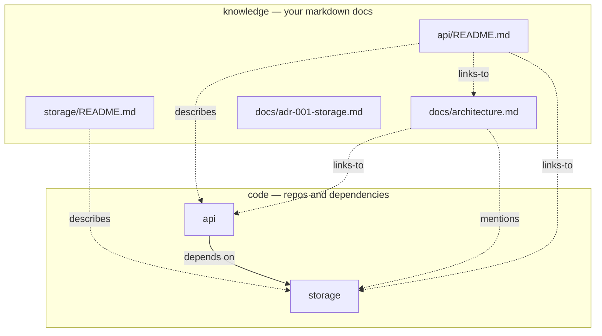
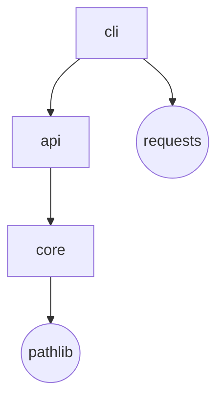

# index

> Every codebase has a shape — and past a handful of repos, it lives only in someone's head. `index` draws it: how your repositories depend on each other, and the docs that explain why, as one map you can open. Built from evidence, not guesses. Zero dependencies.

[](LICENSE)


[](https://github.com/HarperZ9/index-graph/actions/workflows/ci.yml)


Point `index` at a folder of Git repositories and it answers the question that gets harder with every repo you add: *how does all of this actually fit together?* It reads the dependencies the way the code already states them — an import here, a manifest line there — and records each edge with the file and line that proves it. Then `index atlas` does the part most tools skip: it brings your markdown — the READMEs, the ADRs, the design notes — into the same picture, so the explanation sits beside the thing it explains. The result is a single HTML file. No server, no build step, no account; nothing to install but Python.

---

## Why

A program's structure is knowledge, and knowledge that lives in one person's memory is fragile. They go on holiday; they switch teams; they leave. The next person rebuilds the map by grepping, and gets it a little wrong. Meanwhile the documents that hold the *reasons* — why this service exists, why that dependency is allowed — drift in folders nobody opens, unlinked from the code they describe.

`index` turns that map into something you can hold: deterministic, regenerable, and honest about where every line comes from. Who tends to need it:

- **You inherited a workspace you didn't write.** Twenty repos, no diagram, the author long gone. One command gives you something to read on the first day.
- **You run a monorepo, or a product spread across many repos.** You want the dependency lanes at a glance, a cycle caught before it bites, and the doc for a service without spelunking through ten folders.
- **You maintain a lot of open source.** The repos and the docs that explain them, as one map that regenerates the same way every time — so it never quietly drifts from the truth.
- **You're writing onboarding.** Hand someone a file that works offline, forever, and explains itself.

---

## 30-second quickstart

```bash
pip install index-graph

# the two-layer code + knowledge map (the headline):
index atlas --root /path/to/your/workspace --format html --out atlas.html
open atlas.html        # macOS/Linux   ·   start atlas.html on Windows

# or just the repo dependency graph:
index viz --root /path/to/your/workspace --format html --out graph.html
```

Each command writes **one HTML file**. Open it in any browser, offline. Nothing to host, nothing phones home.

---

## `index atlas` — the two-layer map

Most dependency tools stop at the code. But code is only half of what you need to understand a system; the other half is the prose that explains it, and that prose is usually stranded somewhere the graph can't see. `index atlas` adds it back. Every markdown file becomes a node, joined to the code it documents — and you can read it without leaving the map.



The map has four kinds of edge, and each one is *derived* — never inferred by vibe:

| Edge | Means | Comes from |
|------|-------|------------|
| **depends-on** | repo → repo | a real import and manifest dependency, with the witnessing file:line |
| **describes** | doc → repo | the doc lives inside that repo's tree |
| **links-to** | doc → doc/repo | a `[[wiki-link]]` in the doc body |
| **mentions** | doc → doc/repo | the name appears in prose (weakest; dimmed, with a toggle to hide it) |

Open the result and it behaves like a workbench, not a poster:

```
┌──────────────────────────────────────────────┬───────────────────────┐
│  search repos + docs…   [reset][focus][○ ...] │  Architecture  ·doc   │
│                                                │  links: api, storage  │
│       ┌─────┐         ┌─────────┐              │  linked from: api/RE… │
│       │ api │────────▶│ storage │   ← repos    │  ───────────────────  │
│       └──┬──┘         └────┬────┘              │  # Architecture       │
│        · api/README     · storage/README       │  api is the entry;    │
│       · · · ·  knowledge band  · · · ·         │  storage is the core. │
│       ▢ architecture     ▢ adr-001-storage     │  > Rule: api never    │
│   pan · zoom · click a doc to read it rendered │  >   imports a peer.  │
└──────────────────────────────────────────────┴───────────────────────┘
```

- **Pan and zoom** the graph — wheel to zoom about the cursor, drag to pan, one button to reset.
- **Search** repos *and* doc titles together; what doesn't match fades back.
- **Click a doc** and read its **rendered markdown** in place — headings, lists, tables, code, blockquotes — with `[[links]]` you can click to jump to the node they name.
- **Double-click** any node to narrow the view to its neighborhood; click once to clear.
- A **breadcrumb trail** remembers your path, so following a link is always reversible.

A rendered sample ships with the repo: [`examples/atlas-demo.html`](examples/atlas-demo.html) — open it directly, or regenerate it with `python examples/atlas_demo.py`.

> The markdown is rendered **server-side and escaping-safe**, so untrusted doc content can't inject. The whole file is self-contained — no external fonts, scripts, or stylesheets.

---

## What you get

| Output | Command | Description |
|--------|---------|-------------|
| **Code + knowledge dashboard** | `index atlas --format html` | The two-layer map: repos + docs, pan/zoom, search, rendered markdown, `[[links]]` |
| **Atlas pack (JSON)** | `index atlas --json` | The two-layer graph as data — a strict superset of the context pack |
| **Interactive dependency dashboard** | `index viz --format html` | Self-contained; click nodes, follow evidence tooltips, see cycles highlighted |
| **Layered SVG** | `index viz --format svg` | Static vector graph for docs or CI artifacts |
| **Mermaid diagram** | `index viz --format mermaid` | Paste into GitHub markdown or any Mermaid renderer |
| **JSON context manifest** | `index map` | Machine-readable inventory: remotes, branches, dirty counts, classification |
| **Dependency graph (text/JSON)** | `index graph [--cycles]` | Repo→repo edges with evidence; report dependency cycles |
| **Context pack (prose + relations)** | `index context` | Synthesis pack: roles, relations, narrative summary |

---

## CLI reference

```
index atlas   [--root ROOT] [--format html] [--json] [--out FILE] [--no-external]
index map     [--root ROOT] [--output FILE] [--json] [--config CFG]
index graph   [--root ROOT] [--json] [--cycles]
index context [--root ROOT] [--focus REPO]
index viz     [--root ROOT] [--format {html,svg,mermaid,all}]
              [--focus REPO] [--no-external] [--out FILE] [--out-dir DIR]
```

`--focus REPO` narrows a `viz`/`context` render to one repo's dependency neighborhood.
`--no-external` hides stdlib/third-party nodes, keeping the graph to your own repos.
In the `atlas` dashboard, focus is interactive — just double-click a node.

---

## How an edge earns its place

An edge you can't trace is a rumor. `index` resolves each one from two independent signals and grades how well they agree:



When a manifest dependency and an observed import point the same way, that's a high-confidence edge. When only one of them does, it's still recorded — with the exact file and line that witnesses it. Nothing enters the graph on faith.

---

## Configuration

Drop an optional `.index.toml` at your workspace root:

```toml
# .index.toml — at your workspace root
[[rule]]                  # classify repos by workspace-relative path; first match wins
pattern = "oss/**"
class   = "public"

[[rule]]
pattern = "work/**"
class   = "internal"

[scan]
jobs  = 16                    # parallel workers
prune = ["vendor", "target"]  # extra dirs to skip (added to the built-in safety set)

[privacy]
omit_origin_classes = ["internal"]   # drop remote URLs for repos in these classes

[output]
portable = true               # root-relative paths + hashed root (default on)
```

See [`example.index.toml`](example.index.toml) for the full schema and [`USAGE.md`](USAGE.md) for the
complete flag reference, the importable Python API, and worked examples.

---

## What you can count on

- **Evidence on every edge.** No dependency edge exists without a file and line that witnesses it and a confidence grade. The atlas's `describes` / `links-to` / `mentions` edges come from location and `[[links]]`, not from a hunch.
- **The same input, the same output.** Run it twice on a workspace and the JSON and the render come back byte-for-byte identical. No timestamps, no randomness.
- **Nothing to install but Python.** Pure 3.11+ standard library — the markdown renderer and the dashboard's pan/zoom included. A test keeps it that way.
- **Self-contained, and safe with untrusted docs.** One HTML file, no external URLs. Markdown is escaped as it's rendered; a hostile-content test proves it can't break out.
- **Private by default.** Repo paths are root-relative, the local root is reduced to a short hash, and anything credential-shaped in a remote URL is redacted.

---

## Install

```bash
pip install index-graph
```

Or from a checkout:

```bash
pip install -e .
```

Python 3.11+. That is the entire dependency list.

---

`index` is a brick, not the building. The larger work is making software *legible* — its structure, its dependencies, the reasons behind it kept visible and checkable as it grows.

**Zain Dana Harper** · [Portfolio](https://harperz9.github.io) · [HarperZ9](https://github.com/HarperZ9)
<sub>Built with Claude Code; reviewed, tested, and owned by me.</sub>
